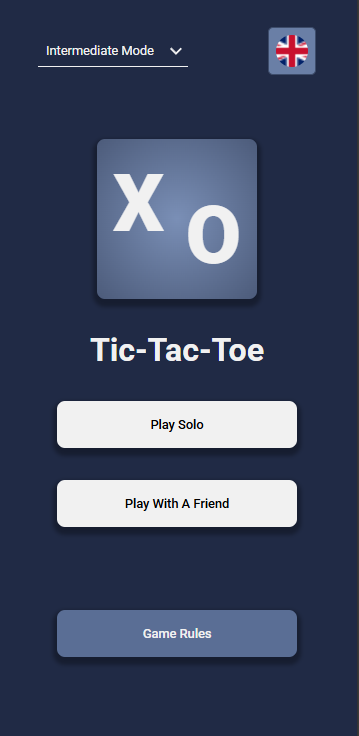
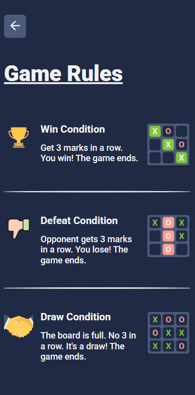
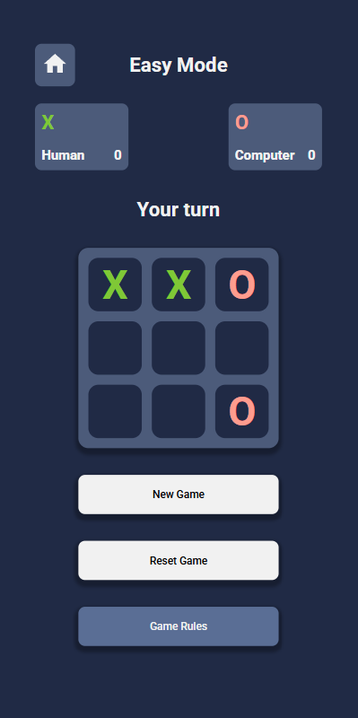

# Odin Tic Tac Toe - Multilingual

A smart and stylish Tic Tac Toe game built with vanilla JavaScript. Play against a friend or challenge the computer on different difficulty levels. Available in multiple languages!

---

## 🎮 [Play the Game](https://szidelo.github.io/odin-tic-tac-toe)

---

## 📸 Screenshots

### Menu



### Rules



### Game



---

## ✨ Features

-   🔁 **Player vs Player** – Classic two-player mode.
-   🤖 **Player vs Computer** – Challenge an AI opponent.
-   🧠 **Difficulty Settings** – Choose from Easy, Medium, Hard or Impossible (Minimax AI).
-   🌍 **Multi-language Support** – Switch between English, German, Italian, Romanian, and Hungarian with dynamic flag icons.
-   🧩 **Clean Architecture** – Factory functions and module pattern ensure separation of logic and UI.
-   📱 **Responsive Design** – Works beautifully across desktop and mobile devices.

---

## 🧠 Technologies & Concepts

-   **HTML5** – Semantic layout
-   **CSS3** – Responsive styling
-   **Vanilla JavaScript** – Factory functions, module pattern, separation of concerns
-   **Minimax Algorithm** – For unbeatable AI on Impossible difficulty
-   **DOM Manipulation** – Dynamic interface updates
-   **JSON** – Language strings storage

---

## 🗂️ Project Structure

```
.
├── index.html          # Main HTML file
├── style.css           # CSS styles
├── script.js           # JavaScript for interactivity
├── translations.JSON   # JavaScript for book card
├── assets/             # Folder for images
└── README.md           # Project documentation
```

---

## 🚀 Getting Started

1. Clone the repository:

    ```bash
    git clone <https://github.com/Szidelo/odin-tic-tac-toe.git>
    ```

2. Navigate to the project directory:

    ```bash
    cd odin-tic-tac-toe
    ```

3. Open index.html in a browser for local testing.

---

## 📚 Acknowledgments

This project was inspired by The Odin Project curriculum and built to sharpen JavaScript fundamentals with real-world architecture and logic separation.

---
